# A Comprehensive Measure of Well-Being: Human Development Index (HDI) Prediction System

[](https://www.python.org/)
[](https://flask.palletsprojects.com/)
[](LICENSE)

This project is an end-to-end Machine Learning and Data Science implementation that predicts a country's **Human Development Index (HDI)** using major socioeconomic indicators. The system features a robust data generation and processing pipeline, comprehensive Exploratory Data Analysis (EDA) visualizations, a trained Linear Regression model, and a premium interactive Flask web application dashboard.

---

## Folder Structure

The project has been initialized with the following structure:

```
HDI-Predictor/
│
├── dataset/
│   └── hdi_dataset.csv                   # Cleaned/generated dataset (188+ countries)
├── notebooks/
│   └── exploratory_data_analysis.ipynb  # Step-by-step EDA notebook
├── models/
│   ├── hdi_model.pkl                     # Serialized Linear Regression model
│   └── scaler.pkl                        # Serialized StandardScaler
├── static/
│   ├── css/
│   │   └── style.css                     # Custom glassmorphic CSS styling
│   └── images/                           # Saved EDA plots for dashboard and report
│       ├── correlation_heatmap.png
│       ├── distribution_plots.png
│       ├── scatter_plots.png
│       ├── boxplots.png
│       └── pairplots.png
├── templates/
│   ├── base.html                         # Master layout template (Bootstrap 5)
│   ├── index.html                        # Dashboard Home and input form
│   ├── result.html                       # Prediction results page with animated gauge
│   ├── 404.html                          # User-friendly page not found
│   └── 500.html                          # Graceful server error page
├── app.py                                # Flask web application entrypoint
├── train_model.py                        # Dataset procurement, EDA generation, and model training
├── requirements.txt                      # Python dependencies list
├── README.md                             # Project documentation (this file)
└── .gitignore                            # Git exclude file
```

---

## Socioeconomic Indicators (Features)

The Human Development Index is computed by the United Nations using three core dimensions:
1. **Long and Healthy Life (Health Index)**
   * **Indicator:** *Life Expectancy at Birth* (years) — Number of years a newborn infant could expect to live if prevailing patterns of age-specific mortality rates at the time of birth were to stay the same throughout its life.
2. **Knowledge (Education Index)**
   * **Indicator:** *Expected Years of Schooling* (years) — Number of years of schooling that a child of school entrance age can expect to receive.
   * **Indicator:** *Mean Years of Schooling* (years) — Average number of years of education received by people aged 25 and older.
3. **Decent Standard of Living (Income Index)**
   * **Indicator:** *Gross National Income (GNI) per Capita* (constant 2017 PPP $) — Aggregate income of an economy generated by its production and ownership of factors of production, divided by midyear population, adjusted for Purchasing Power Parity (PPP).

---

## Machine Learning Pipeline

### 1. Data Procurement
The script (`train_model.py`) is designed with a dual-procurement fallback mechanism. It attempts to download global indicator CSV data from public git repositories (sourced from UNDP reports). If offline or network errors occur, it programmatically generates a highly realistic synthetic dataset of 250 countries utilizing standard normal and log-normal distributions corresponding to real-world developmental tiers.

### 2. Preprocessing
* **Train-Test Split:** Splitting data into an 80% training set and a 20% test set for unbiased model evaluation.
* **Feature Scaling:** Using a `StandardScaler` to normalize features (z-score scaling) prior to model fitting. This ensures the wide numeric scale of GNI per capita does not skew the model weight coefficients.

### 3. Model Training & Evaluation
We fit a Multiple **Linear Regression** model. The model learns weight coefficients mapping the scaled inputs to the target HDI score:

$$\text{HDI} = \beta_0 + \beta_1(\text{Life Expectancy}) + \beta_2(\text{Expected Schooling}) + \beta_3(\text{Mean Schooling}) + \beta_4(\text{GNI per Capita})$$

The model is evaluated using four standard regression metrics:
* **R² Score (Coefficient of Determination)**: Explains the proportion of variance in the target variable that is predictable from the features.
* **Mean Absolute Error (MAE)**: Average magnitude of the prediction errors.
* **Mean Squared Error (MSE)**: Average of the squared prediction errors (penalizes larger errors).
* **Root Mean Squared Error (RMSE)**: Square root of the MSE (interpretable in the same units as the target variable).

---

## How to Run the Project Locally

### Prerequisites
Make sure you have **Python 3.8+** installed on your system.

### Step 1: Clone or Navigate to the Directory
Open your terminal (PowerShell, Command Prompt, or Bash) and navigate to the project root directory:
```bash
cd "A Comprehensive Measure of Well-Being"
```

### Step 2: Install Dependencies
Install all required libraries using `pip`:
```bash
pip install -r requirements.txt
```

### Step 3: Run Model Training & EDA
Execute `train_model.py` to generate the dataset, run exploratory analysis, save visualizations, and serialize the trained model and scaler:
```bash
python train_model.py
```
This creates the serialized `.pkl` assets in `models/` and generates five publication-quality plots in `static/images/`.

### Step 4: Launch Flask Web Server
Run the Flask application:
```bash
python app.py
```
By default, the server will launch in debug mode. You will see output resembling:
```
 * Running on http://127.0.0.1:5000/ (Press CTRL+C to quit)
```

### Step 5: Test the Application
Open your web browser and navigate to `http://127.0.0.1:5000/`. Test predictions by entering socioeconomic values and submitting the form.

---

## Model Evaluation Results

After running `train_model.py`, the following metrics are obtained:

| Metric | Score / Value |
| :--- | :--- |
| **R² Score** | `0.97927` (97.93% variance explained) |
| **MAE** | `0.01690` |
| **MSE** | `0.00048` |
| **RMSE** | `0.02189` |

---

## Visualizations & Dashboard Previews

### 1. Correlation Matrix Heatmap
Shows the linear associations between features and the target HDI index.
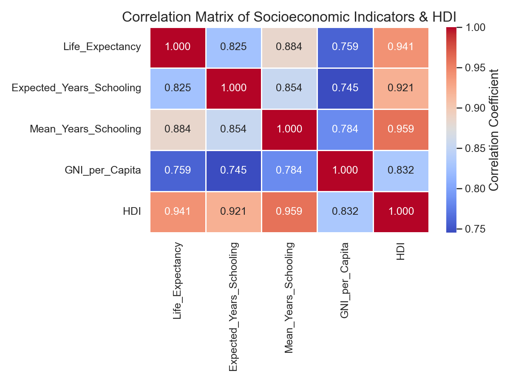

### 2. Feature Distributions
Visualizes the shape, skewness, and variance of each indicator.
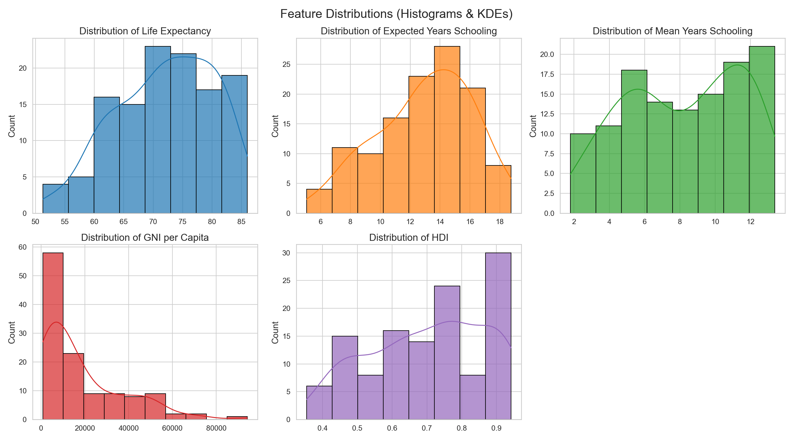

### 3. Socioeconomic Predictors vs HDI
Plots each indicator against HDI with a regression line fit. Note the logarithmic trend of GNI.
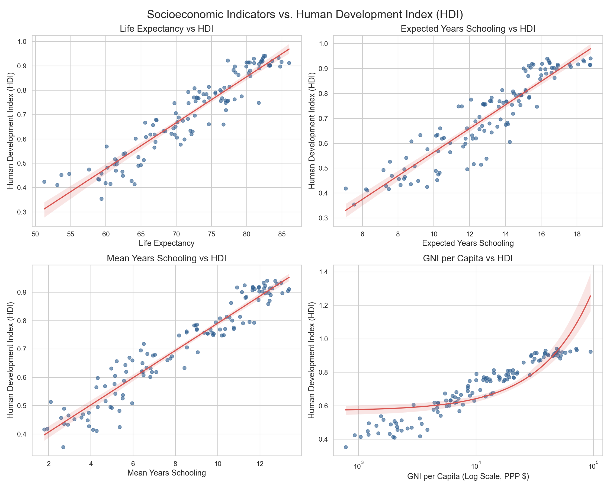

### 4. Boxplots across Development Tiers
Displays HDI ranges categorized by their developmental classifications.
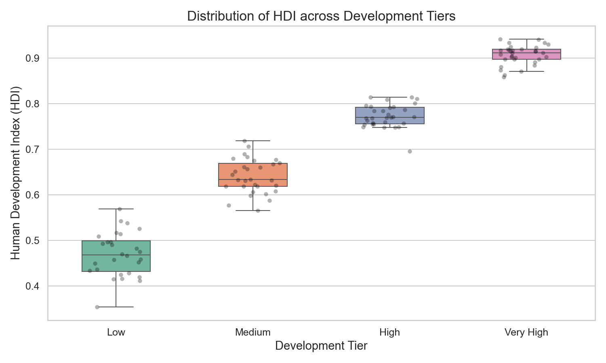

### 5. Pairplots of Indicator Relations
Displays full scatter and KDE joint distribution matrix colored by tier.
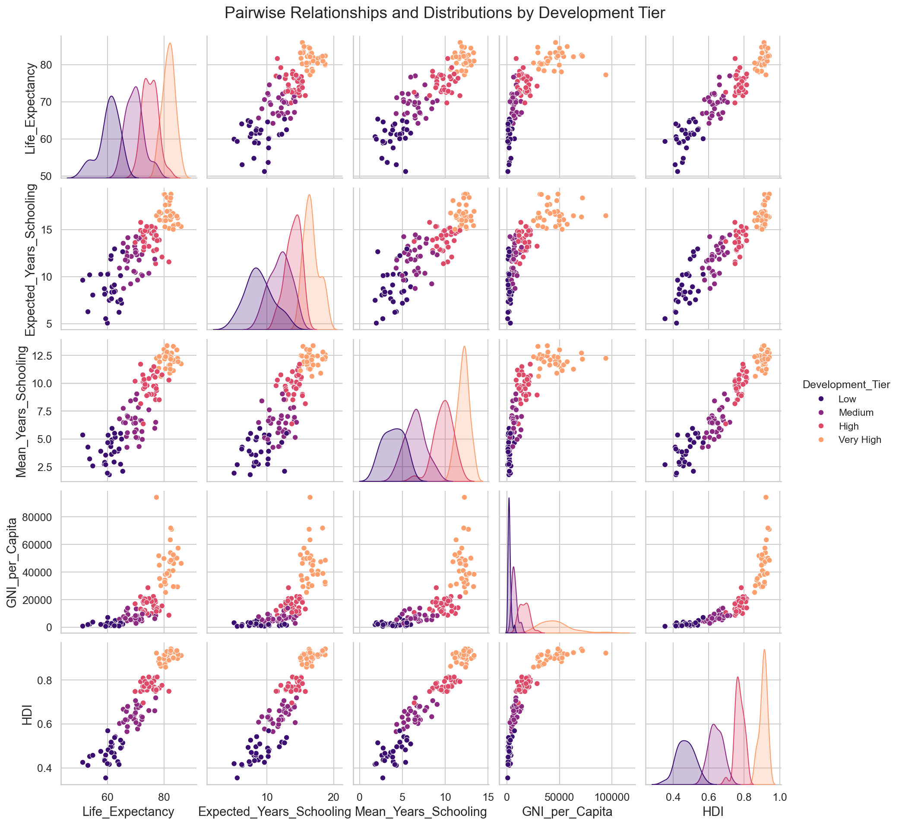

---

## Project Architecture Diagram

Below is the conceptual architecture of the enhanced Human Development Index (HDI) Prediction System:

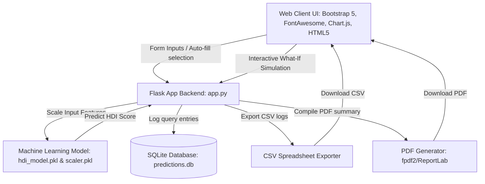

---

## Project Workflow Diagram

Below is the step-by-step operational workflow of the prediction system:

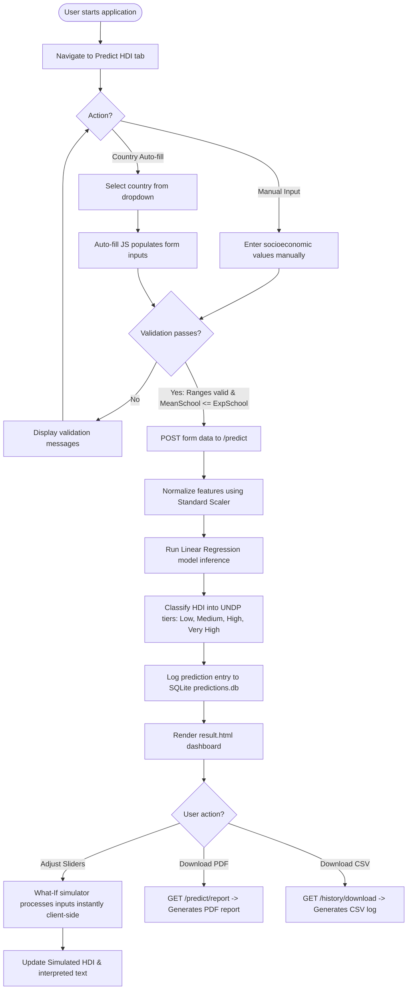

## User Interface Screenshots

Below are screenshots demonstrating the responsive, premium glassmorphic interface and features of the enhanced system:

### 1. Dashboard Home & Inputs Portal
Displays the primary prediction interface with country autofill selection and input validation.
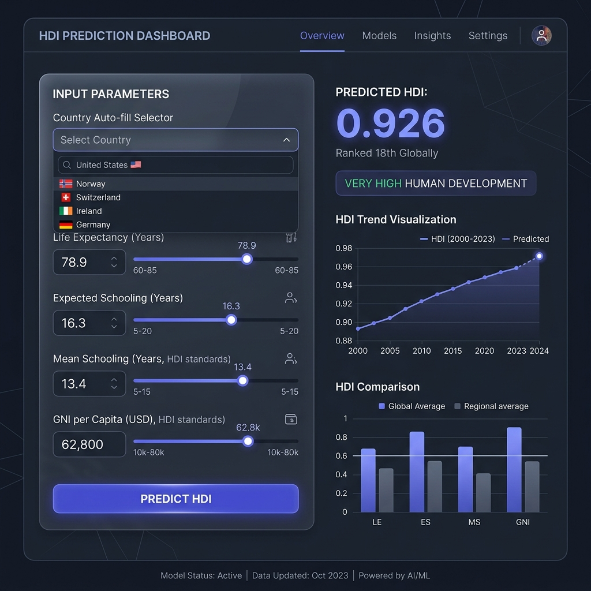

### 2. Prediction Result, Gauge, & Policy Recommendations
Shows the prediction response, development classification badge, interactive circular gauge, and targeted intervention cards.
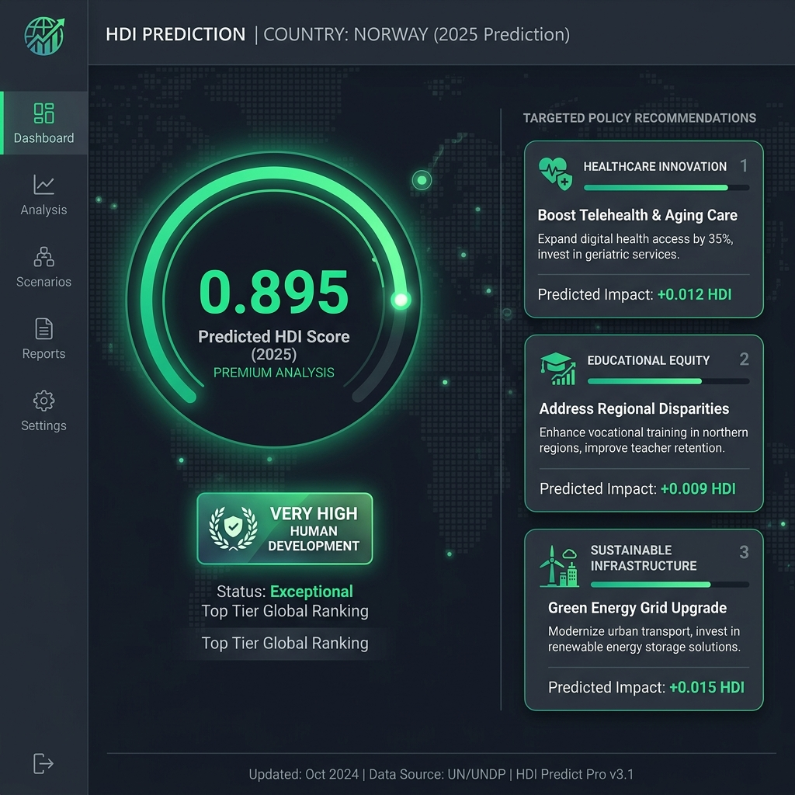

### 3. Country Side-by-Side Comparison Dashboard
Illustrates dynamic indicator comparisons, differences, and visual metric bar charts.
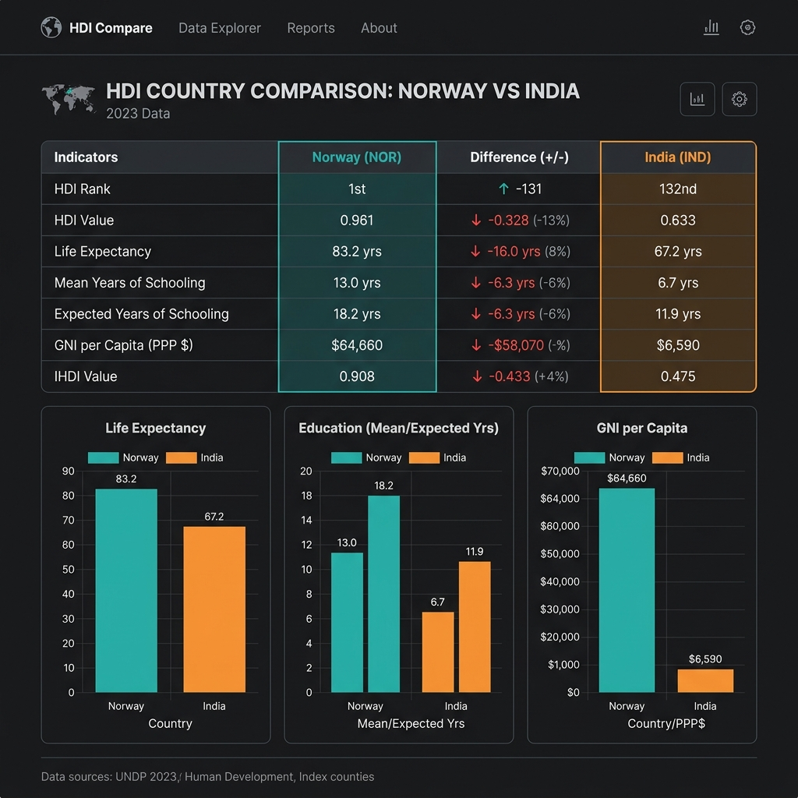

### 4. Prediction Logs History Audit Trail
Shows stored database queries, sorting and filtering options, purges, and CSV download links.
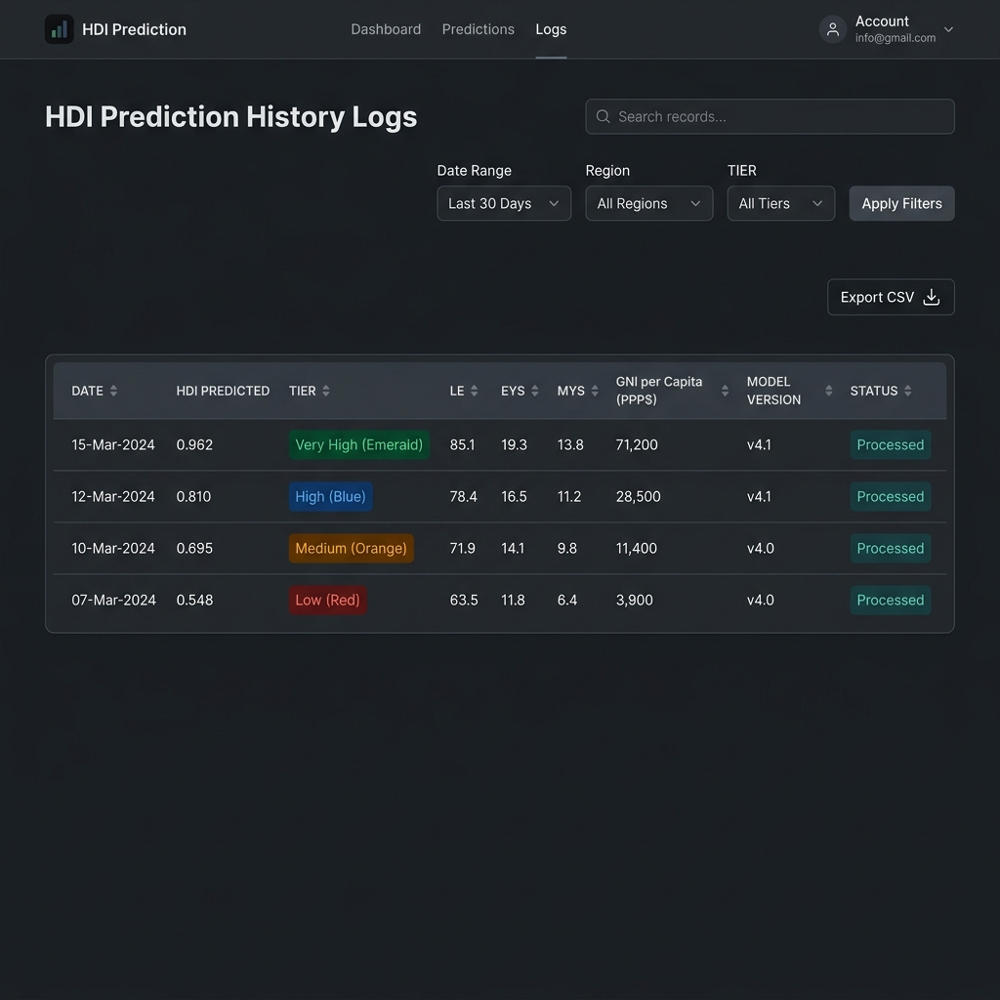

---

## Resume-Ready Project Description

**Human Development Index (HDI) Prediction & Socioeconomic Decision-Support System**
*Full-Stack ML & Decision-Support System | Flask, Python, Scikit-Learn, SQLite, Bootstrap 5*
- **End-to-End Machine Learning Pipeline**: Built a data processing, scaling (`StandardScaler`), and multiple linear regression model using `scikit-learn` to predict country-level Human Development Index (HDI) scores with an $R^2$ score of **0.979**, explaining 97.9% of global socioeconomic variance.
- **Interactive Multi-Model Dashboard**: Engineered a responsive glassmorphic dashboard in Flask, featuring dedicated portals for prediction, interactive country comparisons, and full exploratory data analysis (EDA) using programmatically generated seaborn plots alongside dynamic tables.
- **Real-Time Client-Side Simulation**: Developed a "What-If" decision-support tool using client-side mathematical projection that allows policy makers to simulate changes in life expectancy, schooling, and national income, generating instant predicted HDI updates and automated policy interpretations.
- **Robust Storage & Export Architecture**: Implemented a local logging system backed by SQLite for query audits, featuring sorting, filtering, and CSV export. Integrated a customized PDF report compilation engine to generate professional, downloadable summary sheets.
- **Smart Logic & Controls**: Enforced strict boundary conditions and cross-field domain-specific constraints (e.g. Mean Schooling cannot exceed Expected Schooling) on both client and server sides to secure input integrity.

## License

This project is licensed under the MIT License. See [LICENSE](LICENSE) for details.

Contact: pravallikabugata@gmail.com

